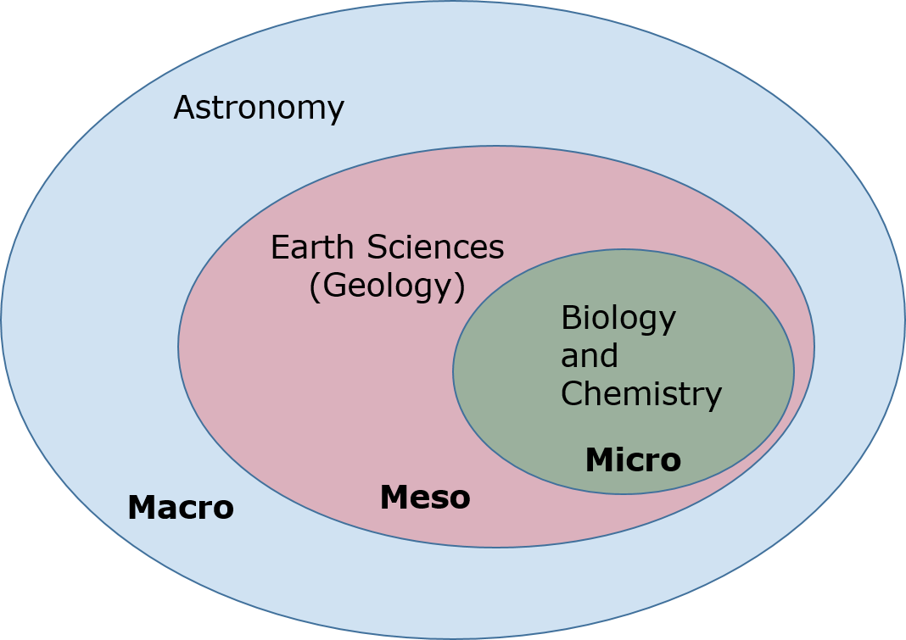

What is Astrobiology
====================

Astrobiology, formerly known as exobiology, is an interdisciplinary scientific field
concerned with the origins, early evolution, distribution, and future of life in the universe. 
Astrobiology considers the question of whether extraterrestrial life exists, and if it does, how 
humans can detect it.  Astrobiology makes use of molecular biology, biophysics, biochemistry, 
chemistry, astronomy, physical cosmology, exoplanetology and geology to investigate the possibility
of life on other worlds and help recognize biospheres that might be different from that on Earth.
The origin and early evolution of life is an inseparable part of the discipline of astrobiology.
Astrobiology concerns itself with interpretation of existing scientific data, and although speculation
is entertained to give context, astrobiology concerns itself primarily with hypotheses that fit firmly 
into existing scientific theories.

This interdisciplinary field encompasses research on the origin of planetary systems, origins of organic
compounds in space, rock-water-carbon interactions, abiogenesis on Earth, planetary habitability, research
on biosignatures for life detection, and studies on the potential for life to adapt to challenges on Earth 
and in outer space.

## Astronomy (Macro)

The largest scale of observation and search for life in the universe.

## Geosciences (Meso)

The role of geosciences to link the macro and micro scales 

## Biology and Chemistry (Micro)

The smallest scale
